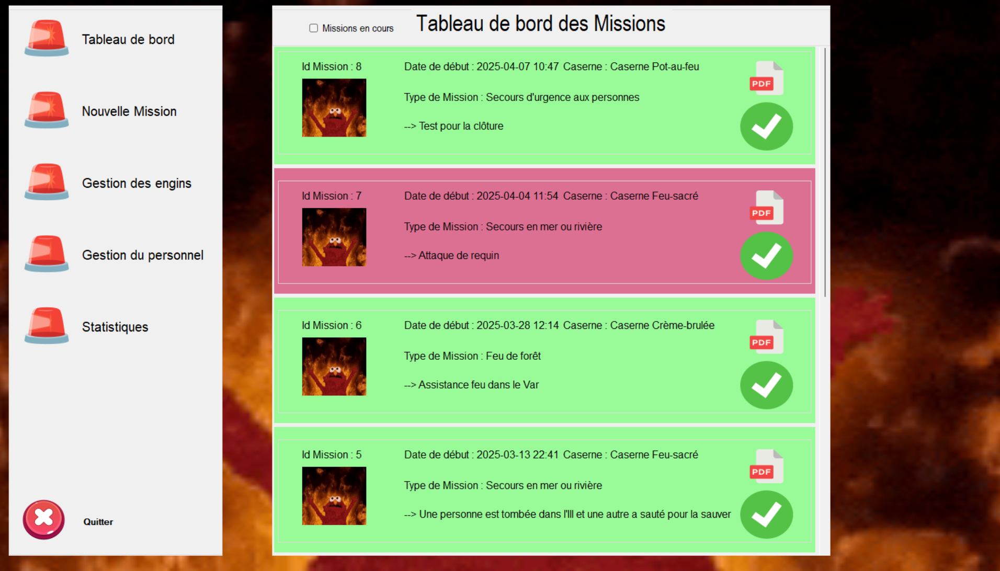
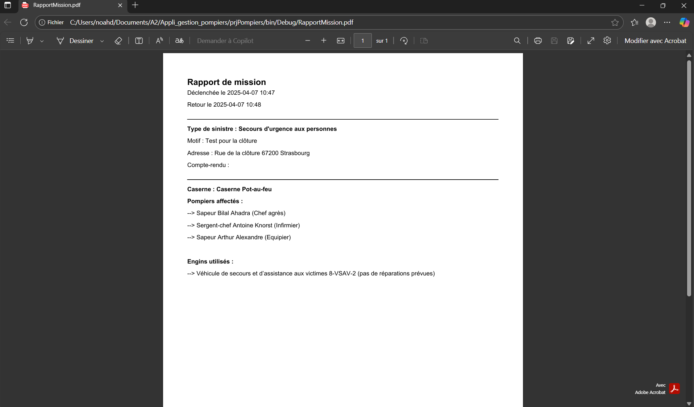
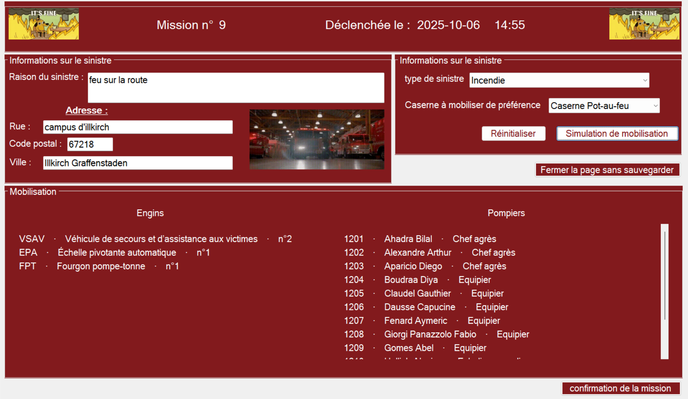
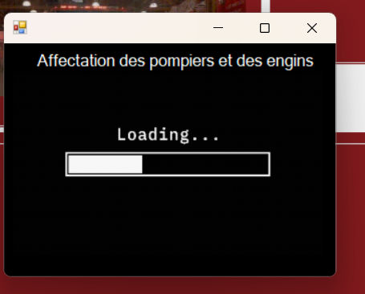
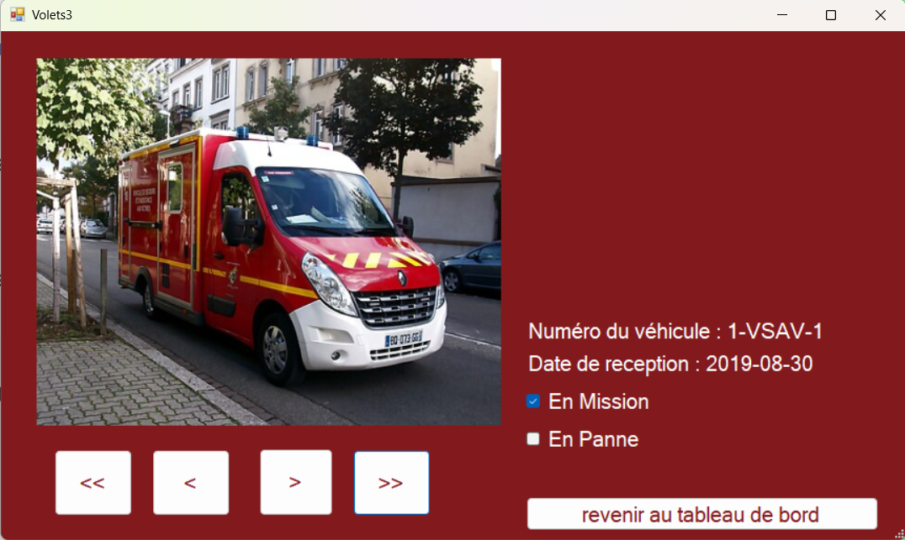
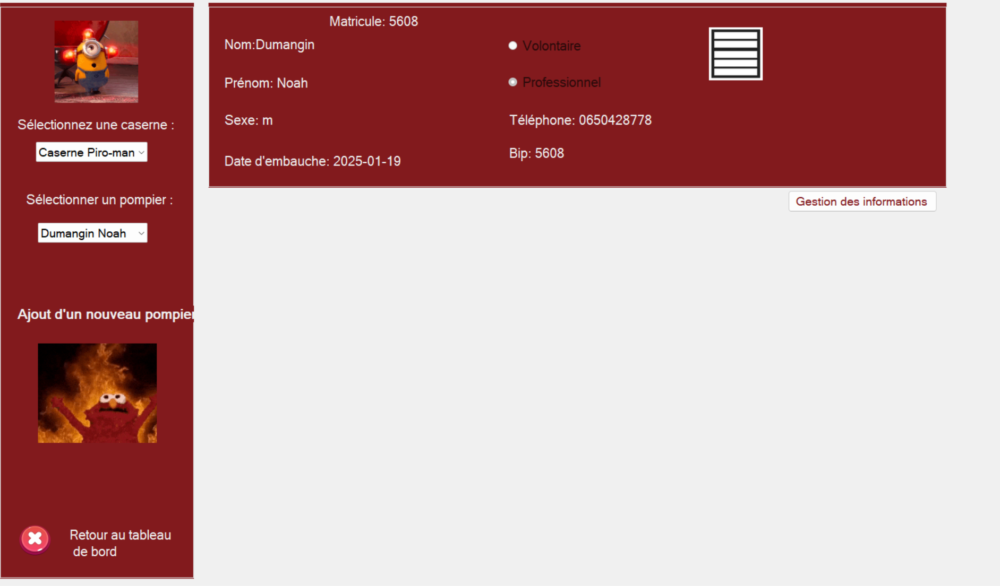
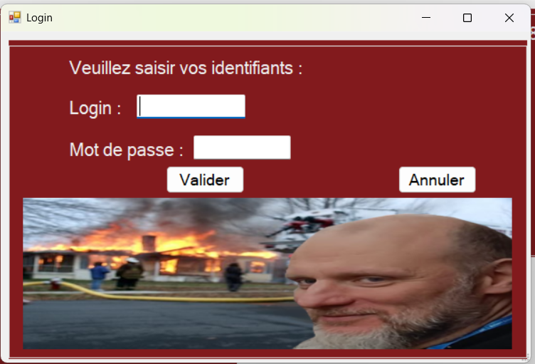
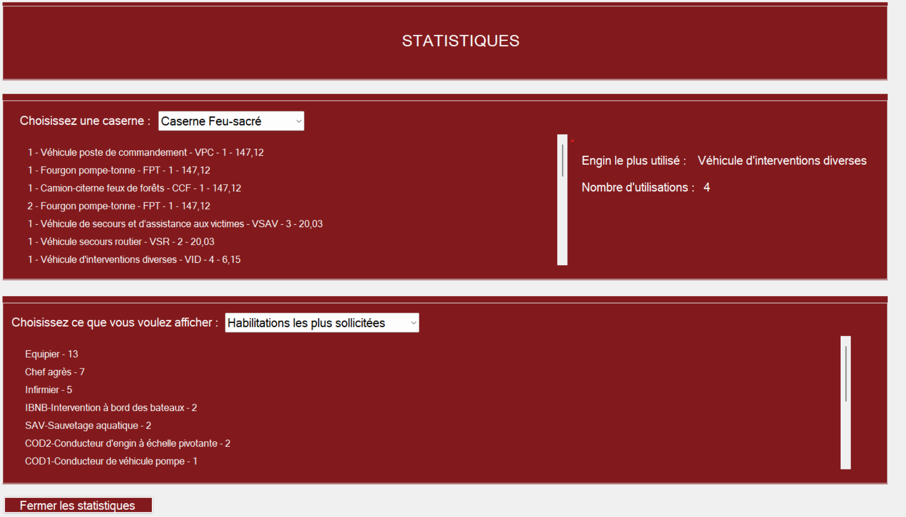

# Application de gestion des pompiers

Ce projet propose une application de **gestion des missions et des interventions des pompiers**, développée en **C# sous Visual Studio**.  
L’application permet de gérer les utilisateurs, d’assurer la connexion des agents, et d’administrer les missions via une interface graphique intuitive connectée à une base de données SQLite.


## Table des matières
- [Description de l'application](#description-de-lapplication)
- [Technologies utilisées](#technologies-utilisées)
- [Installation et lancement](#installation-et-lancement)
- [Collabortaion](#collaboration)
- [Images](#images)

## Description de l'application 

L'application est constituée de 5 fenêtres principales : 

1. **Interface principale**
   L’utilisateur accède à l’interface affichant la liste des missions, leur statut, les détails et les affectations.
   
2. **Gestion des missions**  
   L’utilisateur peut **créer**, **modifier**, **supprimer** (selon les droits) et **consulter** les missions. Les actions sont persistées dans la base SQLite.
   
3. **Gestion des pompiers**
   L'utilisateur peut consulter la base de données pour voir les pompiers avec toutes leurs informations. Il peut aussi modifier ces informations en s'identifiant en tant qu'administrateur. 
   
4. **Statistique**
   L'onglet permet de voir certaines statistiques en choisissant parmi les contraintes existantes.
   
5. **Gestion des engins**
  Permet d'afficher les engins.

Le but de cette application est de réaliser la gestion de plusieurs casernes par les opérateurs qui reçoivent les appels d'urgence principalement.

## Technologies utilisées

- **Langage** : C#
- **IDE** : Visual Studio 2022
- **Base de données** : SQLite (`SDIS67.db`)
- **Interface graphique** : Windows Forms
- **Outils complémentaires** : DB Browser for SQLite, iTextSharp (PDF)

## Installation et lancement

1. **Cloner le projet** 
   ```bash
   git clone https://github.com/tonrepo/sdis-manager.git
   ```
2. **Ouvrir le projet dans Visual Studio**
     Fichier → Ouvrir → Projet/Solution → Sélectionner le fichier .sln
3. **Configurer la base de données**
     - Vérifier que le fichier SDIS67.db est bien présent dans le dossier bin/Debug
     - Sinon, copier manuellement le fichier dans ce dossie
4. ** Lancer l’application**
      Appuyer sur "Démarrer"
   

  ## Collaboration

  Réalisation de ce projet avec 2 étudiants.

  ## Images

  Pour illustrer la présentation voilà des captures d'écrans de l'application : 
  
  
  <br>
  <p>Tableau de bord avec affichage des missions</p>
  <br><br><br>
  
  
  <p>Possibilité de générer un pdf pour les missions</p>
  <br><br><br>
  
  
  <p>Création de missions par les opérateurs des pompiers</p>
  <br><br><br>

  
  <p>Fenêtre de chargement pour la création d'une mission</p>
  <br><br><br>

  
  <p>Fenêtre de visionnage des engins </p>
  <br><br><br>

  
  <p>Fenêtre de visionnage des pompiers avec possibilité de modifications</p>
  <br><br><br>

  
  <p>Possibilité de modification des pompiers avec identification de l'administrateur</p>
  <br><br><br>

  
  <p>Statistiques des casernes/missions/engins</p>
  <br><br><br>
